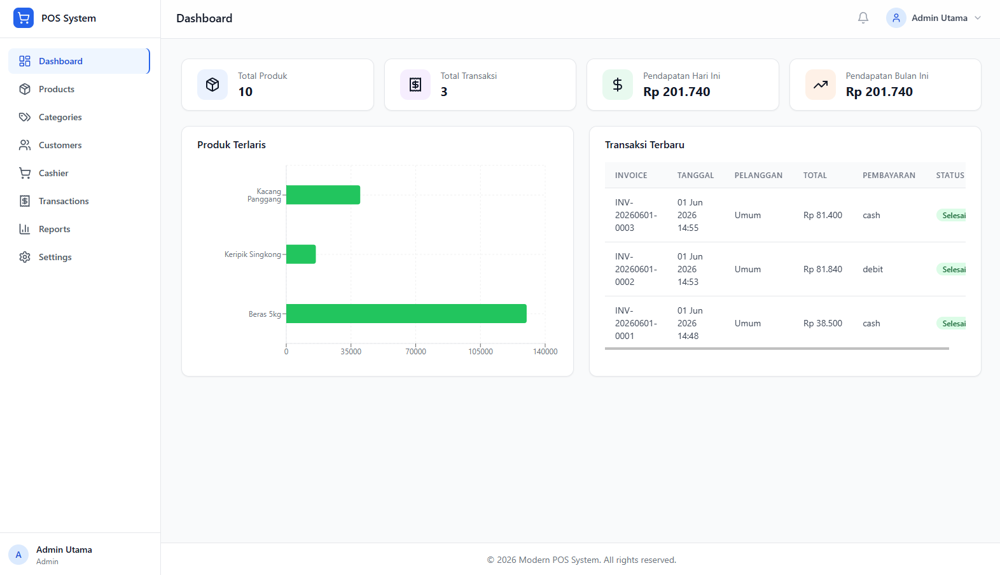
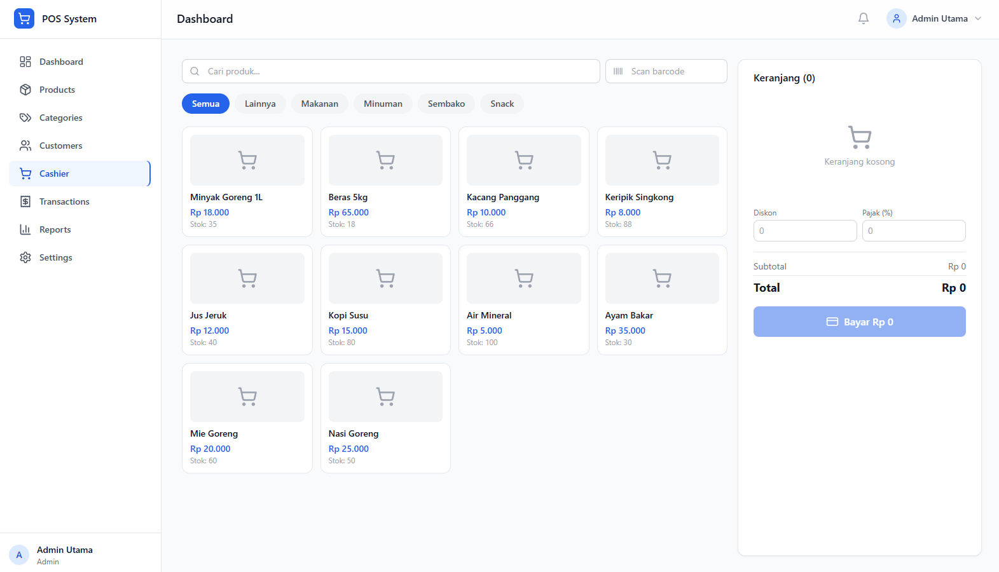
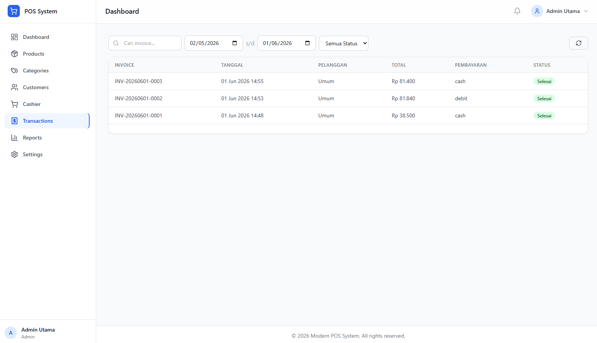
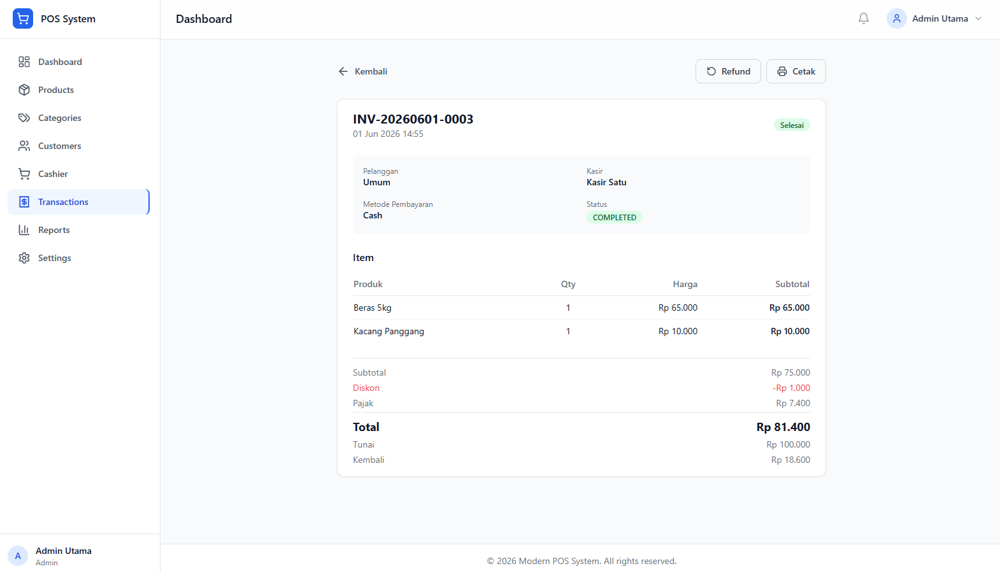
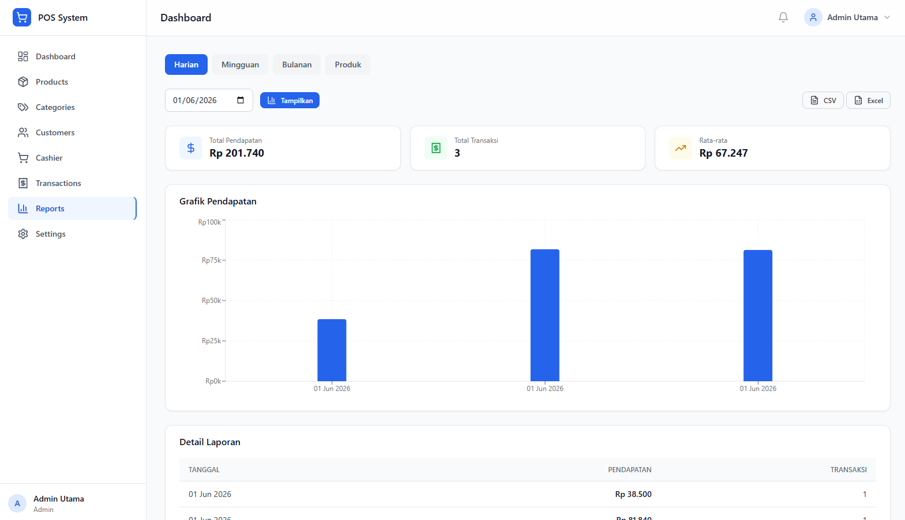

# Modern POS System

A production-ready Point of Sale (POS) system built with modern web technologies. Designed for retail stores, mini markets, coffee shops, and small businesses.

## Features

### Authentication & Role Management
- JWT-based authentication
- Role-based access control (Admin & Cashier)
- Secure login/logout

### Dashboard
- Real-time sales overview
- Total products, transactions, and revenue metrics
- Best-selling products visualization
- Recent transactions feed

### Product Management
- Complete CRUD operations
- Category management
- Barcode support
- Stock tracking
- Product search and filtering
- Image support

### Customer Management
- Customer database with purchase history
- Contact information management
- Customer search

### Cashier Module
- Intuitive POS interface
- Barcode scanning support
- Real-time cart management
- Discount and tax application
- Payment processing with change calculation
- Digital receipt generation

### Transaction Management
- Complete transaction history
- Detailed transaction view
- Refund processing
- Receipt printing

### Reporting & Analytics
- Daily, weekly, and monthly sales reports
- Product performance analysis
- Revenue analytics with charts
- CSV and Excel export

## Technology Stack

### Backend
- **Runtime:** Node.js
- **Language:** TypeScript
- **Framework:** Express.js
- **ORM:** Prisma
- **Database:** PostgreSQL
- **Authentication:** JWT
- **Validation:** Zod
- **Documentation:** Swagger/OpenAPI

### Frontend
- **Framework:** React 18
- **Language:** TypeScript
- **Build Tool:** Vite
- **Styling:** Tailwind CSS
- **State Management:** Zustand
- **Charts:** Recharts
- **HTTP Client:** Axios
- **Routing:** React Router v6

### DevOps
- **Containerization:** Docker & Docker Compose
- **Version Control:** Git

## Prerequisites

- Node.js 18+
- PostgreSQL 14+
- npm or yarn
- Docker (optional)

## Installation

### 1. Clone the Repository

```bash
git clone https://github.com/dzikimalik/modern-pos-system.git
cd modern-pos-system
```

### 2. Backend Setup

```bash
cd backend

# Install dependencies
npm install

# Set up environment variables
cp .env.example .env
# Edit .env with your database credentials

# Run database migrations
npx prisma migrate dev

# Seed the database
npm run prisma:seed

# Start development server
npm run dev
```

### 3. Frontend Setup

```bash
cd frontend

# Install dependencies
npm install

# Start development server
npm run dev
```

### 4. Access the Application

- **Frontend:** http://localhost:5173
- **Backend API:** http://localhost:3000/api/v1
- **API Documentation:** http://localhost:3000/api-docs

### Default Credentials

| Role | Email | Password |
|------|-------|----------|
| Admin | admin@pos.com | admin123 |
| Cashier | cashier@pos.com | cashier123 |

## Docker Deployment

```bash
# Build and run all services
docker-compose up -d

# Run migrations
docker-compose exec backend npx prisma migrate dev

# Seed database
docker-compose exec backend npm run prisma:seed
```

## API Documentation

Full API documentation is available via Swagger UI at `/api-docs` when the backend server is running.

### API Endpoints Overview

#### Authentication
- `POST /api/v1/auth/login` - User login
- `POST /api/v1/auth/register` - Register new user (Admin only)
- `GET /api/v1/auth/me` - Get current user

#### Products
- `GET /api/v1/products` - List products (with pagination, search)
- `GET /api/v1/products/:id` - Get product by ID
- `POST /api/v1/products` - Create product (Admin only)
- `PUT /api/v1/products/:id` - Update product (Admin only)
- `DELETE /api/v1/products/:id` - Delete product (Admin only)
- `GET /api/v1/products/search` - Search products
- `GET /api/v1/products/barcode/:barcode` - Get product by barcode

#### Categories
- `GET /api/v1/categories` - List categories
- `GET /api/v1/categories/:id` - Get category by ID
- `POST /api/v1/categories` - Create category (Admin only)
- `PUT /api/v1/categories/:id` - Update category (Admin only)
- `DELETE /api/v1/categories/:id` - Delete category (Admin only)

#### Customers
- `GET /api/v1/customers` - List customers
- `GET /api/v1/customers/:id` - Get customer by ID
- `POST /api/v1/customers` - Create customer
- `PUT /api/v1/customers/:id` - Update customer
- `DELETE /api/v1/customers/:id` - Delete customer
- `GET /api/v1/customers/search` - Search customers

#### Cashier
- `POST /api/v1/cashier/transaction` - Process payment

#### Transactions
- `GET /api/v1/transactions` - List transactions
- `GET /api/v1/transactions/:id` - Get transaction detail
- `POST /api/v1/transactions/:id/refund` - Refund transaction (Admin only)

#### Dashboard
- `GET /api/v1/dashboard/stats` - Get dashboard statistics
- `GET /api/v1/dashboard/best-selling` - Get best selling products
- `GET /api/v1/dashboard/recent-transactions` - Get recent transactions

#### Reports
- `GET /api/v1/reports/daily` - Daily sales report
- `GET /api/v1/reports/weekly` - Weekly sales report
- `GET /api/v1/reports/monthly` - Monthly sales report
- `GET /api/v1/reports/products` - Product sales report
- `GET /api/v1/reports/export/csv` - Export CSV
- `GET /api/v1/reports/export/excel` - Export Excel

## Project Structure

```
modern-pos-system/
├── backend/
│   ├── src/
│   │   ├── modules/
│   │   ├── controllers/
│   │   ├── services/
│   │   ├── repositories/
│   │   ├── middleware/
│   │   ├── routes/
│   │   ├── validators/
│   │   ├── utils/
│   │   ├── config/
│   │   └── app.ts
│   ├── prisma/
│   ├── tests/
│   ├── docs/
│   └── package.json
├── frontend/
│   ├── src/
│   │   ├── api/
│   │   ├── components/
│   │   ├── pages/
│   │   ├── layouts/
│   │   ├── hooks/
│   │   ├── stores/
│   │   ├── routes/
│   │   ├── types/
│   │   ├── utils/
│   │   └── assets/
│   ├── public/
│   └── package.json
├── docker-compose.yml
├── .gitignore
├── LICENSE
└── README.md
```

## Architecture

### Clean Architecture Layers

1. **Controllers** - HTTP request handling
2. **Services** - Business logic
3. **Repositories** - Data access layer
4. **Validators** - Request validation (Zod)
5. **Middleware** - Cross-cutting concerns (auth, error handling)

### Key Design Patterns

- **Repository Pattern** - Abstracts data access
- **Service Layer** - Encapsulates business logic
- **Dependency Injection** - Via constructor injection
- **Middleware Chain** - Express middleware pipeline

## Future Improvements

- [ ] Multi-tenant support
- [ ] Offline mode with PWA
- [ ] Real-time sync with WebSocket
- [ ] Barcode printing
- [ ] Supplier management
- [ ] Purchase order management
- [ ] Inventory forecasting
- [ ] Multi-currency support
- [ ] Loyalty program
- [ ] Mobile app (React Native)
- [ ] Email receipt delivery
- [ ] Cloud backup integration
- [ ] Dark mode
- [ ] Keyboard shortcuts for cashier
- [ ] Thermal printer integration

## Screenshots

<p align="center">
  
  <br/>
  <em>Dashboard — Ringkasan penjualan, produk terlaris, dan transaksi terbaru</em>
</p>

<br/>

<p align="center">
  
  <br/>
  <em>Cashier — Antarmuka POS dengan pencarian produk, keranjang, dan pembayaran</em>
</p>

<br/>

<p align="center">
  
  <br/>
  <em>Transaksi — Riwayat transaksi dengan filter tanggal dan status</em>
</p>

<br/>

<p align="center">
  
  <br/>
  <em>Detail Transaksi — Informasi lengkap transaksi, item, dan status refund</em>
</p>

<br/>

<p align="center">
  
  <br/>
  <em>Laporan — Grafik pendapatan dan laporan harian/mingguan/bulanan</em>
</p>

## Author

**Dziki Malik**

- GitHub: [@dzikimalik](https://github.com/dzikimalik)
- Website: [https://dzikimalik.dev](https://dzikimalik.dev)

## License

This project is licensed under the MIT License - see the [LICENSE](LICENSE) file for details.

---

Built with ❤️ by Dziki Malik
